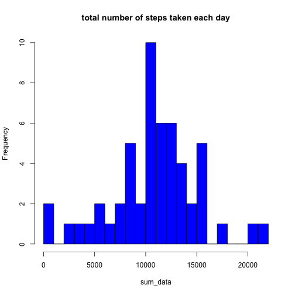
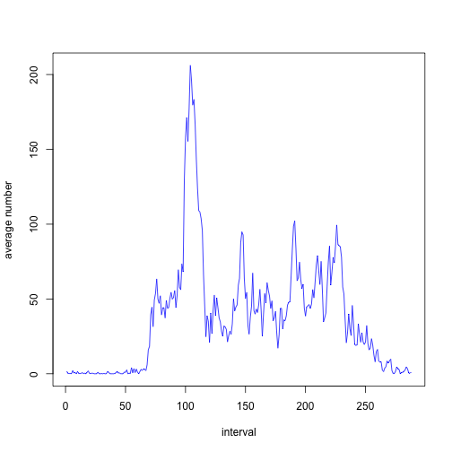
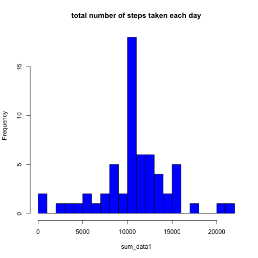
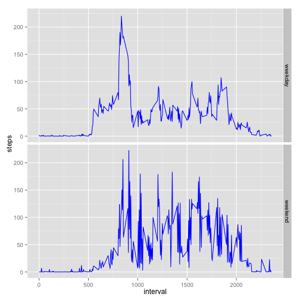

# Loading and preprocessing the data

```r
data <- read.csv(file = "activity.csv")
print(head(data,10))
```

```
##    steps       date interval
## 1     NA 2012-10-01        0
## 2     NA 2012-10-01        5
## 3     NA 2012-10-01       10
## 4     NA 2012-10-01       15
## 5     NA 2012-10-01       20
## 6     NA 2012-10-01       25
## 7     NA 2012-10-01       30
## 8     NA 2012-10-01       35
## 9     NA 2012-10-01       40
## 10    NA 2012-10-01       45
```

# What is mean total number of steps taken per day?

```r
good <- !is.na(data$steps)
sum_data<- tapply(data$steps[good], factor(data[good,"date"]), sum)
hist(sum_data,main = "total number of steps taken each day",breaks = 30,col = "Blue")
```

 

```r
mean_data <- mean(sum_data)
median_data <- median(sum_data)
print(mean_data)
```

```
## [1] 10766.19
```

```r
print(median_data)
```

```
## [1] 10765
```

# What is the average daily activity pattern?

```r
interval_data<- tapply(data$steps[good], factor(data[good,"interval"]), mean)
plot(interval_data,xlab = "interval", ylab = "average number",type = "l",col = "Blue")
```

 

+ Which 5-minute interval, on average across all the days in the dataset, contains the maximum number of steps?

```r
names(interval_data[interval_data == max(interval_data)])
```

```
## [1] "835"
```

# Imputing missing values

```r
miss_row <- data[!good,]
na_number <- nrow(miss_row)
na_number
```

```
## [1] 2304
```

```r
miss_add <- as.vector(interval_data[as.character(miss_row$interval)])
copy_data <- data[,]
copy_data[!good,1] <- miss_add
head(copy_data)
```

```
##       steps       date interval
## 1 1.7169811 2012-10-01        0
## 2 0.3396226 2012-10-01        5
## 3 0.1320755 2012-10-01       10
## 4 0.1509434 2012-10-01       15
## 5 0.0754717 2012-10-01       20
## 6 2.0943396 2012-10-01       25
```

```r
sum_data1<- tapply(copy_data$steps, factor(copy_data[,"date"]), sum)
hist(sum_data1,main = "total number of steps taken each day",breaks = 30,col = "Blue")
```

 

```r
mean_data1 <- mean(sum_data1)
median_data1 <- median(sum_data1)
print(mean_data1)
```

```
## [1] 10766.19
```

```r
print(median_data1)
```

```
## [1] 10766.19
```

# Are there differences in activity patterns between weekdays and weekends?

```r
weekday <- weekdays(as.POSIXct(copy_data$date))
weekday[weekday != c("Saturday","Sunday")] <- "weekday"
weekday[weekday == c("Saturday","Sunday")] <- "weekend"
level <- factor(weekday)
copy_data$date <- level
#将weekday和weekend分开
weekday_data<- tapply(copy_data[level == "weekday",1], factor(copy_data[level == "weekday","interval"]), mean)
weekend_data<- tapply(copy_data[level == "weekend",1], factor(copy_data[level == "weekend","interval"]), mean)
new_data <- c(weekday_data,weekend_data)
new_data <- data.frame(interval = as.numeric(names(new_data)),steps = new_data,week = c(rep("weekday",length(weekday_data)),rep("weekend",length(weekend_data))))

library(ggplot2)
sp <- ggplot(new_data,aes(x = interval,y = steps)) + geom_line(col = "Blue") 
sp + facet_grid(week ~ .)
```

 

